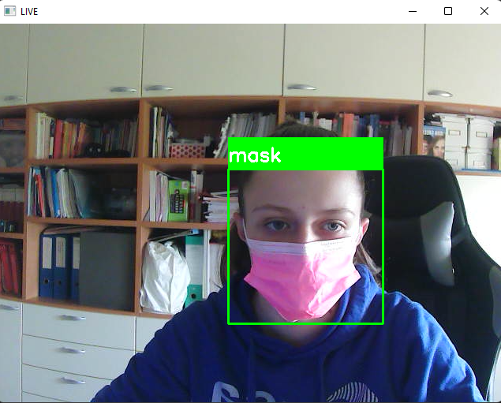
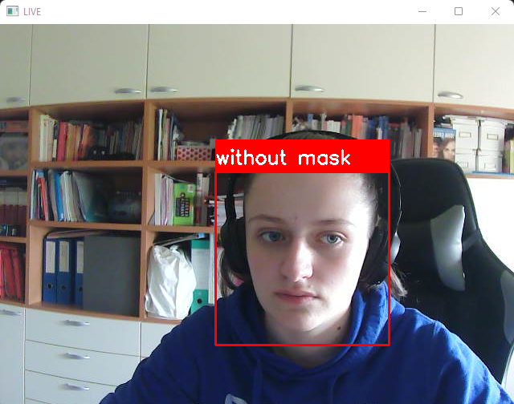

 
<div>
  
  
  
</div><br>
 
<p>Detection of face mask in real time thought for safety against COVID-19.
</p>

### Demo




## Development
### Training
Build the Convolutional Network consists on two pairs of Conv and MaxPool layers to extract features from Dataset.
<br>Followed by a Flatten and Dropout layers to convert the data in 1D and ensure overfitting. 
<br>Two Dense layer for classification.
``` python
model = Sequential([
    Conv2D(100, (3, 3), activation = 'relu', input_shape = (150, 150, 3)),
    MaxPooling2D(2, 2),
    
    Conv2D(100, (3, 3), activation = 'relu'),
    MaxPooling2D(2, 2),
    
    Flatten(),
    Dropout(0.5),
    Dense(50, activation = 'relu'),
    Dense(2, activation = 'softmax')
])
model.compile(optimizer = 'adam', loss = 'binary_crossentropy', metrics = ['acc'])
```
<br>Training the model and save it after each epoch.
``` python
checkpoint = ModelCheckpoint('model-{epoch:03d}.h5', monitor='val_loss', verbose = 0, save_best_only = True, mode = 'auto')
history = model.fit_generator(train_generator,
                              epochs = 30,
                              validation_data = validation_generator,
                              callbacks = [checkpoint])
```
<br>

### Testing
Load the xml file
``` python
classifier = cv2.CascadeClassifier('haarcascade_frontalface_default.xml')
```
<br>Resize the image to speed up detection
``` python
mini = cv2.resize(im, (im.shape[1] // size, im.shape[0] // size))
```
<br>Detect faces
``` python
faces = classifier.detectMultiScale(mini)
```
